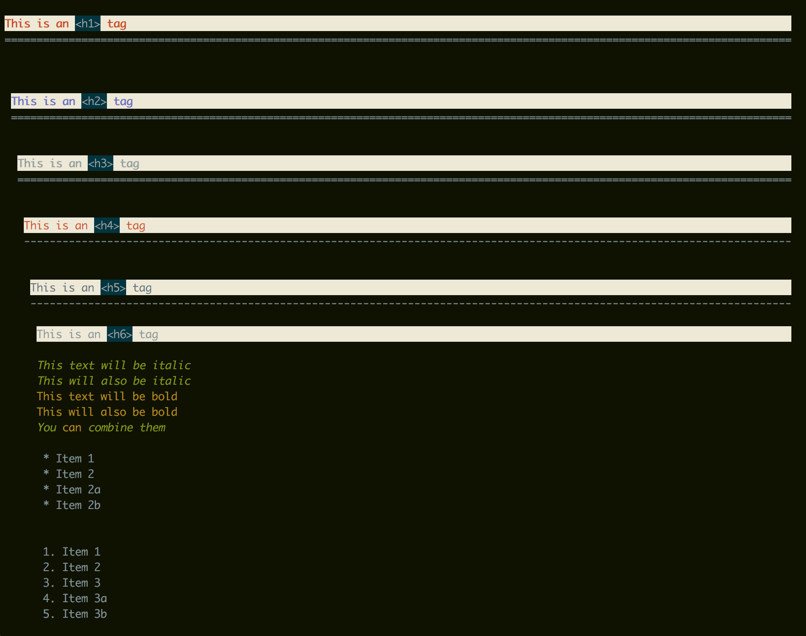

# muv - command line markup documents previewer
Markup languages like markdown are widely used as program documents and personal blogs. While sometimes we tend to work in a command line environment and need to view these makeup files. And there isn't viewers availble to preview them nicely. Now, we have a option.
`muv` is a Python based previewer using urwid as a base display and support lots of features including highlight, padding and so on.
 
* [Example](#examples)
* [Features](#features)
* [Installation](#installation)
    * [pip](#pip)
    * [Manual](#manual)
        * [Requirements](#requirements)
        * [Manual Instalation](#manual-installation)
* [Usage](#usage)
* [Customization](#customization)

## Examples




## Features

1. Text highlight.
2. Code blocks
3. Tables
4. Source code highlight
5. Images and links extraction
6. Custom palette

## Installation

### `pip`

Only support Python3, install with `pip`:
```
pip install muv
```
Notice: urwid package in pipa is outdated, install through [github repo](http://github.com/urwid/urwid) in advance.
### Manual

#### Requirements

* python3
* markdown (pip install markdown)
* urwid, urwid package in pipa is outdated, install through [github repo](http://github.com/urwid/urwid)
* py-gfm
* beautifulsoup4

#### Manual Installation

From your local git repo directory:
```
pip install .
```

## Usage

```
$ muv -h
usage:  [-h] [-p palette file location] [-c config file location] [--version]
        markdown file to view

preview markdown file

positional arguments:
  markdown file to view
                        the file to preview

optional arguments:
  -h, --help            show this help message and exit
  -p palette file location, --palette palette file location
                        palettes file show how tags or class being rendered
  -c config file location, --config config file location
                        possible configurations supported
  --version             look up the version

Markup file previewer by sean
```

## Customization
Currently, you can custom your palette file. Default palette file is in `muv/conf/palette.json`, and it is a json format file which is self described, you can copy this file and change it and put it in the directory `~/.muv/`.

We plan to support user configurations in the future.


